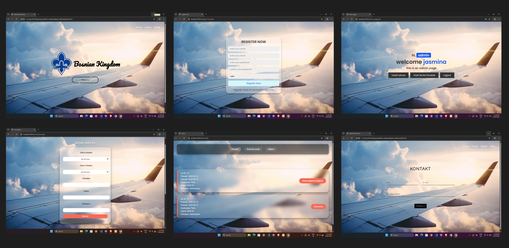

# Airline Booking System 

##  Project Description
Airline Booking System is a web application built with **PHP, HTML, and CSS**, using **phpMyAdmin** as the database management tool.  
The system allows user and admin registration/login, with different functionalities based on account type.  

---

##  Features

###  User
- Register and log in
- View available flights
- Book flights
- Leave reviews
- Contact the company via **Contact page**
- View company information on the **About page**

###  Admin
- Log in as admin
- Add new flights
- Manage existing flights

---

##  Database
- Database created with **phpMyAdmin**
- Main tables:
  - `users` – stores user and admin accounts
  - `flights` – flight details
  - `reservations` – booking information
  - `reviews` – user reviews

---

##  Technologies
- **Frontend**: HTML5, CSS3  
- **Backend**: PHP  
- **Database**: MySQL (via phpMyAdmin)  
- **Server**: XAMPP (Apache, MySQL, PHP)  

---

##  Screenshots

Here is an example of the app:

 More  screens are available on the following Figma link:  
[Figma Project Link](https://www.figma.com/design/xU6xUxhSmKSA4cCkjocW1w/Airline?t=xidUCx2aRn437iV7-0)

